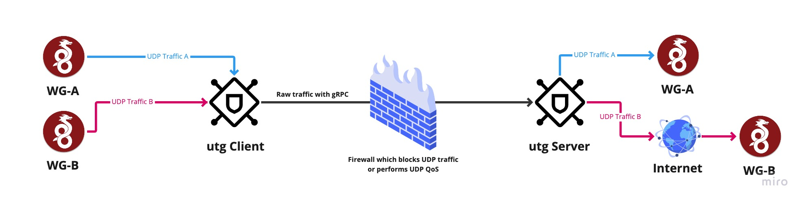

<pre align="center">
   __  ______  ____ ___         ____  ____  ______
  / / / / __ \/ __ \__ \ ____  / __ \/ __ \/ ____/
 / / / / / / / /_/ /_/ // __ \/ /_/ / /_/ / /     
/ /_/ / /_/ / ____/ __// /_/ / _, _/ ____/ /___   
\____/_____/_/   /____/\__, /_/ |_/_/    \____/   
/____/
</pre>

## ⚠️ This project is still in early development. ⚠️



## Inspiration
This project is inspired heavily from [udp2raw](https://github.com/wangyu-/udp2raw)

## UDP2gRPC
A Tunnel which Turns UDP Traffic into Encrypted gRPC/TCP Traffic,helps you Bypass UDP FireWalls(or Unstable UDP Environment)
Assume your UDP is blocked or being QOS-ed or just poorly supported.

## Docker image
Pull dockerhub image
```bash
docker pull mrjoshlab/udp2grpc:latest
```

## Getting Started
### Installing
Download binary release from https://github.com/mrjosh/udp2grpc/releases

### Generate certificates for server and client
Assume your server ip is 127.0.0.1 and your service domain is example.com
```bash
# generate for specific ip address
utg gen-certificates --dir ./cert --ip 127.0.0.1

# generate for specific domain name
utg gen-certificates --dir ./cert --domain example.com

# generate for both domain and ip
utg gen-certificates --dir ./cert --domain example.com --ip 127.0.0.1
```

### Generate a new privatekey
```bash
utg genkey
# output
# R1kvISImDxxRS1AnMDUrSy0xVg9XFzhDCyszGSdAX04=
```

### Generate a new peer config
```bash
utg peer -n Joshua-MBP -r 127.0.0.1:51820
```
output 
```
server side config:
-------------------------------------------------------------
...
peers:
- name: Joshua-MBP
  privatekey: LlRIVyEqVxtZORxdIgoiMTg6UxIsTCBYRC4/K0U4VjM=
  remote: 127.0.0.1:51820
  available_from:
  - 0.0.0.0/0
...

client side config:
-------------------------------------------------------------
client:
  privatekey: LlRIVyEqVxtZORxdIgoiMTg6UxIsTCBYRC4/K0U4VjM=
  remote: '{{ server ip address }}'
  ...
```

### Config
Server side config-file
```yaml
server:

  privatekey: "{{ super-secure-server-private-key }}"
  listen: 0.0.0.0:52935
  tls:
    insecure: false
    cert_file: ./cert/server.crt
    key_file: ./cert/server.key

  peers:
  - name: "PeerName"
    privatekey: "{{ super-secure-client-private-key }}"
    remote: "127.0.0.1:51820"
    available_from:
      - 192.168.1.0/24
```

Client side config-file
```yaml
client:
  privatekey: "{{ super-secure-client-private-key }}"
  listen: 0.0.0.0:51820
  remote: 127.0.0.1:52935
  persistentKeepalive: 30
  tls:
    insecure: false
    cert_file: ./cert/server.crt
```

### Running
Assume your server domain example.com and you have a service listening on udp port 51820.
if you wish to run the server without tls, use the flag `--insecure` for client and server
```bash
# Run at server side:
utg server --config-file server.yaml

# Run at client side:
utg client --config-file client.yaml
```

### Docker-Compose example
```yaml
version: '3.7'

services:

  # init-container
  # generate certifiactes for server and client
  gen-certificates:
    image: mrjoshlab/udp2grpc:latest
    command:
      - "gen-certificates"
      # server ip address
      - "--ip"
      - "127.0.0.1"
      # certificates directory
      - "--dir"
      - "/cert"
    volumes:
      - "$PWD/cert/:/cert"

  # udp2grpc server container
  udp2grpc-server:
    image: mrjoshlab/udp2grpc:latest
    ports:
      - "52935:52935/tcp"
    command:
      - "server"
      - "--config-file"
      - "/config/server.yaml"
    volumes:
      - "$PWD/cert/:/cert"
      - "$PWD/server.yaml:/config/server.yaml"
    restart: unless-stopped
    depends_on:
      gen-certificates:
        condition: service_completed_successfully

  # udp2grpc client container
  udp2grpc-client:
    image: mrjoshlab/udp2grpc:latest
    ports:
      - "51820:51820/udp"
    command:
      - "client"
      - "--config-file"
      - "/config/client.yaml"
    volumes:
      - "$PWD/cert/server.crt:/cert/server.crt"
      - "$PWD/client.yaml:/config/client.yaml"
    restart: unless-stopped
    depends_on:
      gen-certificates:
        condition: service_completed_successfully
```

## Contributing
Thank you for considering contributing to UDP2gRPC project!

## License
The UDP2gRPC is open-source software licensed under the MIT license.
